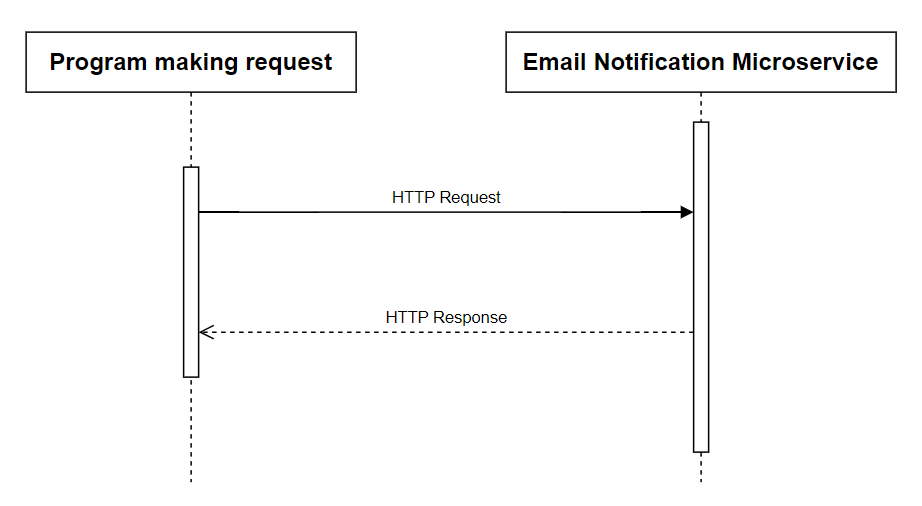

```markdown
# Email Invoice Service

This is a simple Flask application that serves as an email invoice service. It provides endpoints for retrieving existing invoices and creating new ones through HTTP requests. Additionally, it sends an email confirmation to the customer upon successfully creating a new invoice.

## Prerequisites

Before running the application, make sure you have the required dependencies installed. You can install them using the following:

```
pip install Flask Flask-Mail
```

## Configuration

Update the email server configuration in the Flask app:

```python
app.config['MAIL_SERVER'] = 'smtp.gmail.com'
app.config['MAIL_PORT'] = 465
app.config['MAIL_USERNAME'] = 'enter your own email'
app.config['MAIL_PASSWORD'] = 'enter email password'
app.config['MAIL_USE_TLS'] = False
app.config['MAIL_USE_SSL'] = True
...

msg = Message("Test", sender='enter your own email', recipients=[new_email])

```

#### Note to developers:

The Email Notification Microservice will not work with Gmail unless you **enable 2-Step Verification** and **generate an Application password**:

1. Go to the [Google Account](https://myaccount.google.com/) you will use as the sender address for the microservice.
2. Select **Security**.
3. Under "Signing in to Google," select **2-Step Verification** and enable 2-Step Verification.
4. At the bottom of the page, select **App passwords**.
5. Enter a name for your app.
6. Click **Create**.
7. The app password is the 16-character code that is generated on your device.
8. Select **Done**.

Replace `'enter your own email'` with your Gmail account and `'enter email password'` with your 16-character code.

## Running the Application

Run the Flask application by executing the following command in your terminal:

```
python app.py
```

The app will be accessible at [http://127.0.0.1:5000](http://127.0.0.1:5000).

## API Endpoints

### GET / (Root)

- **Description:** Retrieve existing invoices.
- **Method:** GET
- **Response:**
  - Success (200): Returns a JSON list of existing invoices.
  - Not Found (404): Returns 'Nothing Found' if no invoices are available.

### POST / (Root)

- **Description:** Create a new invoice and send an email confirmation.
- **Method:** POST
- **Request Data:**
  - `order_name` (string): Name of the customer.
  - `order_email` (string): Email address of the customer.
  - `order_total` (string): Total amount of the order.
- **Response:**
  - Success (200): Returns 'Email Sent Successfully' upon successful creation and email delivery.

### UML Sequence Diagram




## Example Usage

```python
import requests

flask_app_url = 'http://127.0.0.1:5000'

# Data to be sent with the request
data1 = {'order_name': 'Jennifer', 'order_email': 'youremail@email.com', 'order_total': '$123.45'}
response = requests.post(flask_app_url, data=data1)
print("Response message:", response.text)

This tester.py file is available in the repository. This example sends a POST request to the root endpoint with sample order information and prints the response message.

Feel free to customize the application for your specific use case.
```
